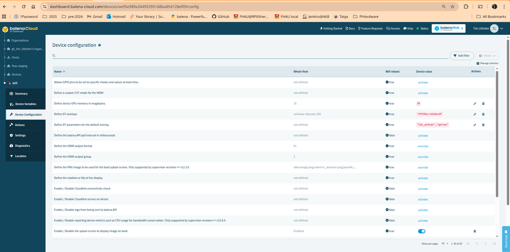

Technical Notes
===============

Integrating a custom .dtbo file on Balena
-----------------------------------------
As part of the Raspberry Pi deployment target for this project I wanted to 
support optionally displaying either a 2D barcode or text rendering of the 
local network HTTP URL to which a user could connect to from a tablet in 
order to operate the web UI of the application.

I purchased this inexpensive no-name 3.5" 480x320 GPIO-attached screen from 
Australian seller Core Electronics:
https://core-electronics.com.au/3-5inch-display-module-touch-lcd-with-stylus-for-raspberry-pi-3.html.

The seller's page warns that the screen is not supported on Bookworm OS 
(Debian 12), so I wasn't certain whether it would work for my project, which 
uses the 
`Balena IOT deployment framework <http://balena.io>`_
.

I followed the link provided on the seller's page to 
https://github.com/goodtft/LCD-show
and identified
https://github.com/goodtft/LCD-show/raw/refs/heads/master/usr/tft35a-overlay.dtb
as the direct URL to download the required device tree overload file.

Some of the configuration settings recommended in the LCD-show script LCD-35-show are as follows:

.. code::

    ...
    sudo echo "hdmi_force_hotplug=1" >> ./boot/config.txt.bak
    sudo echo "dtparam=i2c_arm=on" >> ./boot/config.txt.bak
    sudo echo "dtparam=spi=on" >> ./boot/config.txt.bak
    ...
    sudo echo "dtoverlay=tft35a:rotate=90" >> ./boot/config.txt.bak
    ...

Rather than change all of the recommended parameters from the script these 
on the command line, I made changes only to the items shown in the lines 
above on the Balena configuration page for the target device.

After the changes, this page looked like this:

Before installing the .dtb file, I did a reboot to confirm that the RPi would 
still boot normally under the modified configuration even if the overlay 
required for the screen had not been manually installed. The device booted 
normally and the standard HDMI screen appeared looking more or less identical
to the way it looked with the out-of-the-box configuration set by the Balena 
framework, so it is probably safe to include the configuration changes 
required to activate the GPIO-attached screen at the fleet level where it 
will be inherited by all devices in the fleet, whether or not the tft35a.dtbo
file is deployed or whether there is a screen attached to the GPIO.

Finally, after confirming that the required config changes were safe even
if the .dtbo file was not installed, I used the 'Host OS' terminal login 
panel on the Balena device summary page and entered the following commands:

.. code::

    cd /mnt/boot/overlays
    wget https://github.com/goodtft/LCD-show/raw/refs/heads/master/usr/tft35a-overlay.dtb
    mv tft35a-overlay.dtb tft35a.dtbo
    reboot

After the reboot, the Balena splash image was displayed to the 3.5" screen,
and the web page displayed on the HDMI monitor output remained as expected.

..
   Maybe do something about...
   https://forums.balena.io/t/can-we-add-a-dtbo-max9860-dtbo-file-to-an-already-deployed-device/357397

udev rules required to run as non-root user on Ubuntu
-----------------------------------------------------

The udev rules file /usr/lib/udev/rules.d/50-mustang.rules which is
installed by the very old version of mustang-plug which is available
in the Ubuntu 24.04 LTS repository contains of multiple lines like
this:

.. code:: 

	SUBSYSTEM=="usb", ENV{DEVTYPE}=="usb_device", ATTRS{idVendor}=="1ed8", ATTRS{idProduct}=="0015", GROUP="plugdev"

The purpose of this rule is to allow user-space access to the device.
Without it, it is necessary to run any given program with root
privileges using 'sudo' in order to be able to open the USB device.

I added a similar line with no idProduct filter to try to get my
Mustang LT40S enabled for userspace access, but this did not work
for my Java/USB/CLI example.1ed8

After looking at
https://unix.stackexchange.com/questions/85379/dev-hidraw-read-permissions
I added the following line instead:

.. code:: 

	SUBSYSTEM=="hidraw", ATTRS{idVendor}=="1ed8", MODE="0660", GROUP="plugdev", TAG+="uaccess"

With this line the CLI example started working.

Note that for some reason, this was not required to get the precursor plug
program working in userspace.  Not sure why yet.

NB This change was only required on my development workstation where I 
was running the executable as a non-root user.  It was not required
for the Balena/RPi deployment as the executable runs as root in that 
configuration.  This change is not applicable to running the program under
non-Linux environments:

- macOS is not a supported environment at present but the CLI program 
  appears to be working when I test it there;
- Windows is also not supported, the CLI program may or may not run, 
  but the web integration definitely won't work as it depends on 
  symbolic links stored in Git, and a Git checkout in Windows doesn't
  have support for proper symlinks.
  

