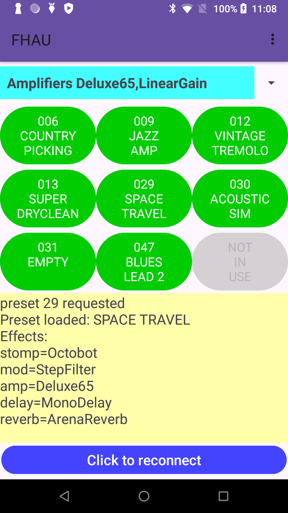

Quickstart for FHAU applications version 0.1.1
##############################################

Building
--------

Both desktop CLI and Android mobile formats of app form part of a single Gradle 
project which can be built with the command line

.. code-block:: shell

    ./gradlew build

run from the top level directory of the repository.

This depends on the build machine having appropriate versions of Java and 
various Android SDK packages installed.  If you are very lucky you may 
have compatible versions of all of the dependencies you need already 
installed and the command above may work first time, but if not there is a 
script in the repository which can be run to download appropriate 
versions of these initial dependencies, which can be run with the a command 
like this:

.. code-block:: shell

    ./scripts/rebuild_sdk.sh FHAU.sdk

This script will take a few minutes, when it has completed there should be a directory
../FHAU.sdk relative to the top level directory of the repository, and running the 
command 

.. code-block:: shell

   . ../FHAU.sdk/fhau_sdk_vars.sh

should set PATH and other environment variables to values which allow the new 
downloaded packages to be activate in preference over pre-installed versions
of the same utilities ready for the `gradlew` command to run.

Once Java and Android SDK packages are installed, all other dependencies (including
the dependency on gradle itself) should be handled by the gradle command.

The project can also be built using either of the following IDEs:

- Android Studio Android Studio Meerkat | 2024.3.1 Patch 1

- IntelliJ IDEA 2025.1 (Community Edition)

When using an IDE, it may be necessary to manually configure the Java and Android SDK 
locations to use the packages downloaded by the ``scripts/rebuild_sdk.sh`` script.

Desktop CLI Usage
-----------------

From the root directory of the repository, connect the amplifier up via USB, turn it on
and run the command:

.. code-block:: shell

    scripts/run_desktop_cli.sh

On the first run this script will output a wordy disclaimer and request
that the user reply 'yes' to a request to confirm that they accept the 
risks to their hardware implied by running experimental software.

If the user does not reply yes, the same disclaimer will be presented 
on next run.  Once the user does reply yes, re-running the software 
will cause it to attempt to connect to the Fender device.  

Once the disclaimer is accepted, the next run of the program will
attempt to connect to the USB device, and if the connection succeeds, 
the program will dump a table of the presets stored in the amplifier 
to the console, and will also create a file in the _work subdirectory 
with name composed of the current date and time with the zip suffix, 
containing JSON definitions of the presets exported from the amplifier.

On Linux, the initial connect attempt is expected to fail, because
the program requires a small change to a system configuration file
before the OS will allow USB devices to be accessed.  If this 
occurs the program will output directions for the change to be 
made (which will require system administration 'sudo' privileges),
and hopefully future runs will succeed as described above.

The desktop app can also be run in interactive mode, using the command

.. code-block:: shell

    scripts/run_desktop_cli.sh --interactive

In this mode the app prompts for commands on the console, and can 
be used to switch presets by entering a command of the 
form ``preset 27``.  This mode is primarily intended for development
testing and exploration and is not intended to evolve into a 
feature for normal users.

Android Usage
-------------

The Android app can be built and installed from an IDE, or side-loaded using
the standard capabilities of the ADB program.

A video demonstration of the usage of the app is available here:
https://drive.google.com/file/d/1nqPzorRsGRrGbL4jmq64_8rjcI38sLn5/view?usp=sharing

The mobile screen in the video isn't particularly clear, so here's an 
example screenshot:

In this screenshot the suite containing presets based on the Deluxe65 and LinearGain 
amplifier models has been selected, the button labelled '029/SPACE/TRAVEL' has 
been clicked, that preset has been activated and the yellow information area shows 
that the audio chain for this preset which is now active consists of 
the following effects and amplifier:

- stomp effect 'Octobot'

- mod effect 'StepFilter'

- amplifier 'LinearGain'

- delay effect 'MonoDelay'

- reverb effect 'ArenaReverb'
